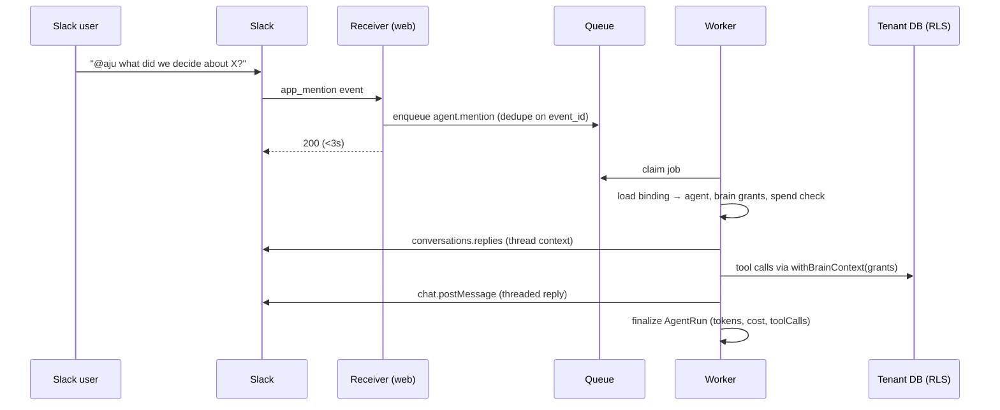

# Build Spec — aju Tag (@aju for Slack)

**Status:** M1–M3 implemented (flag-gated, dormant by default) — pending Slack app registration + dogfooding. M4 (ambient) not started.
**Owner:** Toomas
**Last updated:** 2026-07-03

---

## 1. Summary

aju Tag makes aju addressable as a teammate in Slack. Users mention `@aju` in a channel or DM to **save, recall, and answer from team memory**; the reply arrives in-thread. Each Slack channel is bound to an aju **agent identity** and one or more **brains**, so memory captured in one channel never bleeds into another — the same isolation model aju already enforces at the database layer.

Positioning: general "AI teammates" in chat platforms keep their memory locked inside that platform. aju Tag's job is narrower and sharper — capture and recall. Everything it learns lands in ordinary brain documents, immediately usable from every other aju surface (MCP, CLI, web, API).

**Scope discipline:** v1 is a _memory agent_, not a general task agent. The verbs are: search, read, summarize, capture, answer-from-brain. No code execution, no external tools, no arbitrary task automation.

## 2. Goals

1. `@aju` mention in a bound channel → agent answers from / writes to the bound brain(s), replies in thread.
2. Channel ↔ identity ↔ brain binding with DB-enforced isolation (existing RLS).
3. All agent writes carry `provenance: agent`, land `unvalidated`, and flow through the existing validation lifecycle.
4. Per-org spend limits and a per-run audit trail (who asked, what ran, what it cost).
5. **Zero regression risk to core aju**: if every new component is deleted or down, existing aju behaves identically.

## 3. Non-goals (v1)

- Ambient mode (monitoring un-mentioned messages) — specced as Phase 2, behind a flag, off by default.
- Platforms other than Slack (Teams, Discord, email-in).
- Destructive tools: the agent has **no delete** capability in any phase.
- Slack file ingestion into `VaultFile` (stretch, Phase 2+).
- Cross-brain "connect memories" admin feature.
- Slash commands / message shortcuts (possible later; mention-only in v1).
- Per-user personal-brain DMs (v1 DMs operate on the binding configured for the DM scope, not personal brains — see Open Questions).

## 4. Guiding principle: strictly additive

| Layer                                     | Rule                                                                                                                                                     |
| ----------------------------------------- | -------------------------------------------------------------------------------------------------------------------------------------------------------- |
| Tenant DB (`data/tenant/schema.prisma`)   | **No schema changes in Phase 1.** Captured memory is plain `VaultDocument` rows written through existing libs. Avoids tenant migration fan-out entirely. |
| Control DB (`data/control/schema.prisma`) | New tables only. No column changes to existing models.                                                                                                   |
| Existing routes / MCP / CLI               | Untouched. New routes live under `/api/integrations/slack/*` and `/api/agent-runs/*`.                                                                    |
| Runtime                                   | New worker is a **separate Railway service** (same repo, new start script). The web service's `start` script is unchanged.                               |
| Existing libs                             | Consumed, not modified. Where a lib function isn't directly reusable, add a new adapter in `src/lib/agent/` rather than editing the original.            |
| Feature flag                              | Everything gated on `INTEGRATION_SLACK_ENABLED=1`. Flag off → routes return 404, worker exits at boot, UI hidden.                                        |

## 5. Architecture

```mermaid
flowchart LR
    subgraph Slack
        EV[Events API<br/>app_mention, message.im]
        CH[chat.postMessage]
    end
    subgraph web["aju web service (existing Next.js app)"]
        R["/api/integrations/slack/events<br/>verify sig · dedupe · enqueue · ack <3s"]
        O["/api/integrations/slack/oauth<br/>install + callback"]
        UI["Org settings UI<br/>bindings · limits · run log"]
    end
    subgraph ctrl[(Control DB)]
        T1[SlackInstallation]
        T2[SlackChannelBinding]
        T3[AgentRun]
        Q[(graphile_worker schema)]
    end
    subgraph wrk["aju agent worker (new Railway service)"]
        L["Agent loop<br/>Claude API tool-use"]
        AT["src/lib/agent/tools.ts<br/>adapters over existing vault/search libs"]
    end
    subgraph tenant[(Tenant DB per org)]
        B["Brains + VaultDocuments<br/>RLS on app.current_brain_ids"]
    end

    EV --> R --> Q --> L
    O --> T1
    UI --> T2
    L --> AT -->|withBrainContext| B
    L -->|reply in thread| CH
    L --> T3
```

### 5.1 Component inventory

| Component                            | Location                                                                                            | New/Existing           |
| ------------------------------------ | --------------------------------------------------------------------------------------------------- | ---------------------- |
| Slack event receiver + OAuth install | `src/app/api/integrations/slack/{events,oauth}/route.ts`                                            | New                    |
| Job queue                            | Graphile Worker on the control DB (own `graphile_worker` schema, outside Prisma)                    | New                    |
| Agent worker service                 | `src/worker/main.ts`, started via `npm run worker`                                                  | New                    |
| Agent runtime + tool adapters        | `src/lib/agent/` (`loop.ts`, `tools.ts`, `prompt.ts`, `slack.ts`, `metering.ts`)                    | New                    |
| Control-plane models                 | `SlackInstallation`, `SlackChannelBinding`, `AgentRun`, `IntegrationSpendLimit`                     | New                    |
| Memory write path                    | existing create/update flow with `source: "ingest"` / agent principal                               | Existing (reused)      |
| Retrieval                            | existing FTS / hybrid / deep-search libs                                                            | Existing (reused)      |
| Isolation                            | existing `withBrainContext` RLS (`src/lib/tenant/context.ts`)                                       | Existing (reused)      |
| Audit                                | extend `AuditEventType` union in `src/lib/audit/index.ts` (additive) + new `AgentRun` table         | Existing + new         |
| Spend limits                         | new `enforceAgentSpendLimit()` following the `enforce*` pattern in `src/lib/billing/plan-limits.ts` | New (existing pattern) |
| Secrets at rest                      | reuse AES-GCM helpers (`src/lib/tenant/crypto.ts` pattern) for bot tokens                           | Existing (reused)      |

## 6. Slack app

One multi-workspace Slack app ("aju"), distributed via standard OAuth v2. **Events over HTTPS** (not Socket Mode — hosted SaaS with public endpoints; Socket Mode complicates multi-tenant distribution).

**Bot scopes (v1):** `app_mentions:read`, `chat:write`, `channels:read`, `channels:history`, `groups:history` (private channels the bot is invited to), `im:history`, `im:write`, `users:read`.
No user-token scopes, ever — the bot acts only as itself (agent-level identity, never user credentials).

**Events subscribed (v1):** `app_mention`, `message.im`. Phase 2 adds `message.channels` / `message.groups` for ambient bindings only.

**Receiver contract:**

- Verify Slack signature (`v0` HMAC, reject timestamps older than 5 min).
- Dedupe on `event_id` (Slack retries up to 3×) — unique `dedupeKey` on the job insert makes retries no-ops.
- Enqueue `agent.mention` job and ack `200` immediately. No business logic in the request path; total budget well under Slack's 3 s.
- `url_verification` challenge handled inline.

**Install flow:** org admin clicks "Add to Slack" in org settings → OAuth → callback stores `SlackInstallation` (bot token AES-GCM encrypted) linked to the aju org. One installation per (org, Slack team). Reinstall rotates the token in place.

## 7. Data model additions (control plane only)

```prisma
model SlackInstallation {
  id               String   @id @default(cuid())
  organizationId   String
  teamId           String   // Slack workspace id
  teamName         String
  botUserId        String
  botTokenEnc      String   // AES-GCM, same envelope pattern as tenant DSNs
  scopes           String
  installedByUserId String
  status           String   @default("active") // active | revoked
  createdAt        DateTime @default(now())
  updatedAt        DateTime @updatedAt
  bindings         SlackChannelBinding[]
  @@unique([organizationId, teamId])
  @@index([teamId])
}

model SlackChannelBinding {
  id             String   @id @default(cuid())
  installationId String
  installation   SlackInstallation @relation(fields: [installationId], references: [id], onDelete: Cascade)
  channelId      String   // Slack channel id; "im" bindings use the DM scope sentinel
  channelName    String
  // Tenant-side ids stored as opaque strings (tenant rows live in another DB);
  // validated against the tenant DB at bind time and on each run.
  agentId        String   // tenant Agent — the "identity" for this channel
  brainId        String   // primary brain; agent's BrainAccess grants are the source of truth
  mode           String   @default("mention") // mention | ambient (Phase 2)
  toolPolicy     Json?    // optional per-binding tool allowlist override
  status         String   @default("active")  // active | paused
  createdAt      DateTime @default(now())
  updatedAt      DateTime @updatedAt
  @@unique([installationId, channelId])
}

model AgentRun {
  id              String    @id @default(cuid())
  organizationId  String
  installationId  String
  bindingId       String
  channelId       String
  threadTs        String?
  requestedBySlackUserId String
  requestedByUserId      String?  // mapped aju user when email matches, else null
  agentId         String
  status          String    @default("queued") // queued | running | done | failed | refused
  model           String?
  inputTokens     Int       @default(0)
  outputTokens    Int       @default(0)
  costCents       Int       @default(0)
  toolCalls       Json?     // [{tool, path?, brainId, ms}]
  error           String?
  startedAt       DateTime?
  finishedAt      DateTime?
  createdAt       DateTime  @default(now())
  @@index([organizationId, createdAt])
  @@index([bindingId, createdAt])
}

model IntegrationSpendLimit {
  id               String  @id @default(cuid())
  organizationId   String  @unique
  monthlyCostCents Int     @default(2000) // conservative default cap
  hardStop         Boolean @default(true)
  updatedAt        DateTime @updatedAt
}
```

Notes:

- Graphile Worker owns its `graphile_worker` schema in the control DB — created by its own migration runner at worker boot, invisible to Prisma. `prisma migrate deploy` is unaffected.
- **No tenant schema changes.** `agentId`/`brainId` are opaque references; a run re-validates them (agent exists, has `BrainAccess` editor on the brain) before doing anything, and pauses the binding with an admin notice if validation fails (e.g. brain deleted).

## 8. Agent runtime

### 8.1 Job flow (mention)



### 8.2 Loop

- Claude API tool-use loop in `src/lib/agent/loop.ts` (`@anthropic-ai/sdk`, already a dependency). Default model `claude-sonnet-5`; per-binding override possible later. Hard caps per run: max 12 tool iterations, max token budget, 120 s wall clock — exceeding any cap ends the run with a graceful "here's what I have so far" reply.
- Context assembly: system prompt (identity, brain scope, capture conventions, injection guardrails) + up to N recent thread messages via `conversations.replies` + the mention text. Slack user ids resolved to display names for readability.
- Spend check before starting (`enforceAgentSpendLimit`): if the org is over its monthly cap and `hardStop`, reply with a fixed "monthly agent budget reached" message, mark run `refused`, never call the model.

### 8.3 Tools (v1 allowlist)

Thin adapters in `src/lib/agent/tools.ts` over existing libs — **the MCP modules are not modified**. Every tool executes inside `withBrainContext` limited to the agent's `BrainAccess` grants, so out-of-scope reads are impossible at the Postgres layer, not just the prompt layer.

| Tool               | Wraps                                                                | Notes                          |
| ------------------ | -------------------------------------------------------------------- | ------------------------------ |
| `search`           | FTS search lib                                                       | validation-aware ranking as-is |
| `semantic_search`  | hybrid/vector lib                                                    |                                |
| `deep_search`      | GraphRAG deep-search lib                                             |                                |
| `read` / `browse`  | vault read/browse                                                    |                                |
| `capture`          | vault create (`source: "ingest"` path semantics via agent principal) | see §9                         |
| `append_or_update` | vault update with CAS + merge                                        |                                |

No delete. No file tools. No network. `toolPolicy` on the binding can narrow (never widen) this list — e.g. a read-only binding for a sensitive channel.

### 8.4 Prompt-injection posture

Channel text is untrusted input steering an agent that holds write keys. Mitigations are structural, not prompt-only:

1. Agent key grants: editor on bound brain(s) only; never org roles; RLS enforced.
2. Writes are `provenance: agent` + `unvalidated` → ranked down in search until a human validates; disqualification flow already exists for poisoned content.
3. No destructive or exfiltrating tools exist to be hijacked (no delete, no HTTP, no email).
4. Per-run iteration/token/time caps bound blast radius.
5. Full `toolCalls` log per run for review.

## 9. Memory write conventions (tenant side, zero schema change)

Captured memory is ordinary markdown in the bound brain:

- **Path convention:** `slack/<channel-name>/YYYY-MM-DD-<slug>-<threadTs>.md`
- **Frontmatter:** `docType: slack-capture`, `tags: [slack, <channel-name>]`, plus `channel`, `thread_ts`, `permalink`, `participants` — all through the existing frontmatter parser, so `docType`/`tags` filtering in search works unchanged.
- **Body:** distilled summary first, then a `## Raw thread` section with the verbatim messages (author + timestamp). Summaries are lossy; the raw source must survive next to them.
- Embeddings, FTS, wikilink graph, versions, changelog: all automatic via the existing create/update pipeline. Nothing new to build.

## 10. Admin surface

New pages under org settings (visible to org owner/admin only, flag-gated):

1. **Install** — Add-to-Slack button; installation status; uninstall (marks revoked, pauses bindings).
2. **Bindings** — table: channel → identity (agent) → brain → mode → status. Create/edit binds a channel; creating an identity inline reuses existing agent provisioning + `BrainAccess` grant flow.
3. **Spend** — monthly cap, current month usage (from `AgentRun` aggregates), hard-stop toggle.
4. **Run log** — paginated `AgentRun` list: when, channel, requester, status, tokens/cost, expandable tool-call trace.

Control-plane audit: extend the `AuditEventType` union additively (`slack.install`, `slack.uninstall`, `binding.create|update|pause`, `spend_limit.update`) and `recordAudit()` at each mutation.

## 11. Worker service

- Entrypoint `src/worker/main.ts`; script `"worker": "tsx src/worker/main.ts"` in `package.json` (additive).
- Railway: second service on the same repo with custom start command `npm run worker`. Web service config untouched.
- Graphile Worker runner with task list `{ "agent.mention": ..., "agent.ambient": (Phase 2) }`, concurrency via `WORKER_CONCURRENCY` (default 4), built-in exponential backoff, max 5 attempts, then failed-job row retained for inspection.
- Boot check: exits 0 immediately when `INTEGRATION_SLACK_ENABLED` ≠ 1 (safe to deploy dormant).
- Graceful shutdown on SIGTERM (finish in-flight run, release jobs).
- Later consolidation opportunity (out of scope): the `CRON_SECRET` HTTP cron routes could migrate to Graphile cron.

## 12. Config additions

```
INTEGRATION_SLACK_ENABLED=      # master flag, default off
SLACK_CLIENT_ID=
SLACK_CLIENT_SECRET=
SLACK_SIGNING_SECRET=
ANTHROPIC_API_KEY=              # platform key; BYOK per org is a later option
AGENT_MODEL=claude-sonnet-5     # default model
WORKER_CONCURRENCY=4
```

## 13. Explicitly untouched

`/api/vault/*`, `/api/mcp` + `src/lib/mcp/tools/*`, `client/mcp/aju-server.ts`, the Go CLI, OAuth/device auth flows, tenant schema + RLS policies + migrations, embedding pipeline, existing cron routes, `start` script, existing UI routes. CI check idea: a smoke test asserting the app boots and all existing route modules resolve with the flag off.

## 14. Milestones & acceptance criteria

### M1 — Plumbing (receiver + queue + worker skeleton)

- OAuth install flow stores an encrypted installation; uninstall revokes.
- Events endpoint: signature verified (unit-tested with fixture payloads), challenge handled, duplicate `event_id` enqueues exactly one job.
- Worker claims a stub job and posts a canned threaded reply in a dev workspace.
- Flag off → endpoint 404s, worker exits, UI hidden.

### M2 — Memory agent (v1 core)

- Binding CRUD in org settings; bind-time validation of agent + brain against the tenant DB.
- `@aju <question>` answers from the bound brain using search/read tools; reply cites doc paths.
- `@aju remember this thread` creates a `slack-capture` doc matching §9 (frontmatter, summary + raw, provenance `agent`, `unvalidated`), visible in web UI and via MCP search immediately.
- **Isolation test (blocking):** binding whose agent has grants only on brain A — prompt attempts to read brain B; tool layer returns nothing and RLS blocks at SQL level (asserted both ways).
- Runs recorded in `AgentRun` with token counts and tool traces.

### M3 — Guardrails + admin

- Spend cap enforced (`refused` run + fixed reply when over cap); usage visible in settings.
- Run log UI; audit events on all mutations.
- Rate limiting on the events endpoint (reuse `src/lib/rate-limit.ts`); dedupe + retry behavior verified under forced worker crash (job retries, no duplicate Slack replies — reply idempotency key on `AgentRun`).
- Dogfooding in our own workspace for 2+ weeks before any external org.

### M4 — Phase 2: ambient capture (separate go/no-go after M3)

- `mode: ambient` bindings subscribe to channel messages; cheap-model (Haiku-tier) relevance pass batches per thread; memory-worthy threads distilled per §9 on thread quiescence.
- Stalled-thread nudge: worker cron flags threads where @aju was engaged and no resolution message followed within a configurable window.
- Off by default, per-channel opt-in, clearly labeled in channel via bot join message.

## 15. Open questions (decide before M2)

1. **DM semantics** — v1: DMs map to a single org-level "DM binding" (one shared identity), or disable DMs entirely? Per-user personal-brain DMs need Slack-user→aju-user identity mapping and personal-brain grants; proposal: **disable DMs in v1**, revisit with identity mapping.
2. **Multi-brain bindings** — schema stores one primary `brainId`, but grants are the real boundary. Allow the agent to read all granted brains but write only to the primary? Proposal: yes.
3. **Model tier** — Sonnet default with per-binding Opus opt-in, or Opus-only for answer quality? Cost delta is ~5×; proposal: Sonnet default, measure.
4. **Billing** — do agent runs consume a plan-tier allowance (extend `PLAN_LIMITS`) or a separate metered add-on? Affects `IntegrationSpendLimit` defaults.
5. **Slack Marketplace listing** — needed for frictionless install by outside orgs (review process, ~weeks). Not needed for design partners installing an unlisted app. When to submit?
