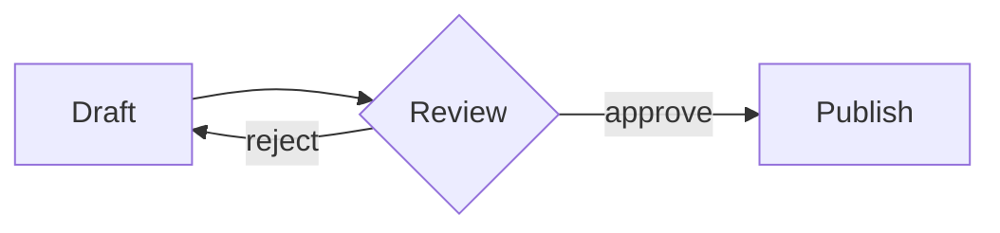

# Diagrams in documents

Documents are plain markdown, but two fenced code block languages get
progressive enhancement in the web app: ` ```mermaid ` and ` ```bpmn `.
Everywhere else — the CLI, the API, exports — they stay ordinary code
blocks, so nothing downstream needs to understand them.

Rendering happens client-side and lazily: the diagram libraries only
load on pages that actually contain a matching block. Each rendered
figure has a copy button (copies the source) and an expand button
(fullscreen pan/zoom). If a block fails to parse, an inline error is
shown and the original code block is left in place.

## Mermaid

Any [Mermaid](https://mermaid.js.org) diagram type works:



## BPMN 2.0

A ` ```bpmn ` block must contain a complete BPMN 2.0 XML document,
rendered with [bpmn-js](https://bpmn.io). Two rules matter:

1. **The DI section is required.** bpmn-js does no auto-layout. Every
   element needs a `BPMNShape` (with `dc:Bounds`) and every sequence
   flow a `BPMNEdge` (with `di:waypoint`s) inside the
   `bpmndi:BPMNDiagram` section, or the import fails with an inline
   error. Files exported from any BPMN modeler include this already;
   hand-written XML must too.
2. **Only bpmn fences render.** A plain ` ```xml ` block is left
   alone, so XML snippets in ordinary notes are never hijacked.

Minimal working skeleton to copy:

```bpmn
<?xml version="1.0" encoding="UTF-8"?>
<bpmn:definitions xmlns:bpmn="http://www.omg.org/spec/BPMN/20100524/MODEL"
                  xmlns:bpmndi="http://www.omg.org/spec/BPMN/20100524/DI"
                  xmlns:dc="http://www.omg.org/spec/DD/20100524/DC"
                  xmlns:di="http://www.omg.org/spec/DD/20100524/DI"
                  id="Definitions_1"
                  targetNamespace="http://bpmn.io/schema/bpmn">
  <bpmn:process id="Process_1" isExecutable="false">
    <bpmn:startEvent id="Start_1" name="Request received">
      <bpmn:outgoing>Flow_1</bpmn:outgoing>
    </bpmn:startEvent>
    <bpmn:task id="Task_1" name="Handle request">
      <bpmn:incoming>Flow_1</bpmn:incoming>
      <bpmn:outgoing>Flow_2</bpmn:outgoing>
    </bpmn:task>
    <bpmn:endEvent id="End_1" name="Done">
      <bpmn:incoming>Flow_2</bpmn:incoming>
    </bpmn:endEvent>
    <bpmn:sequenceFlow id="Flow_1" sourceRef="Start_1" targetRef="Task_1" />
    <bpmn:sequenceFlow id="Flow_2" sourceRef="Task_1" targetRef="End_1" />
  </bpmn:process>
  <bpmndi:BPMNDiagram id="BPMNDiagram_1">
    <bpmndi:BPMNPlane id="BPMNPlane_1" bpmnElement="Process_1">
      <bpmndi:BPMNShape id="Start_1_di" bpmnElement="Start_1">
        <dc:Bounds x="152" y="102" width="36" height="36" />
      </bpmndi:BPMNShape>
      <bpmndi:BPMNShape id="Task_1_di" bpmnElement="Task_1">
        <dc:Bounds x="240" y="80" width="100" height="80" />
      </bpmndi:BPMNShape>
      <bpmndi:BPMNShape id="End_1_di" bpmnElement="End_1">
        <dc:Bounds x="392" y="102" width="36" height="36" />
      </bpmndi:BPMNShape>
      <bpmndi:BPMNEdge id="Flow_1_di" bpmnElement="Flow_1">
        <di:waypoint x="188" y="120" />
        <di:waypoint x="240" y="120" />
      </bpmndi:BPMNEdge>
      <bpmndi:BPMNEdge id="Flow_2_di" bpmnElement="Flow_2">
        <di:waypoint x="340" y="120" />
        <di:waypoint x="392" y="120" />
      </bpmndi:BPMNEdge>
    </bpmndi:BPMNPlane>
  </bpmndi:BPMNDiagram>
</bpmn:definitions>
```

Layout conventions that read well: events are 36×36, tasks 100×80,
gateways 50×50; flow left-to-right on a shared horizontal centerline;
leave ~50px gaps between shapes. For processes beyond ~20 elements,
model in a dedicated BPMN tool and paste the exported XML into the
fence.

BPMN figures carry a "powered by bpmn.io" attribution link — a
requirement of the bpmn-js license.
