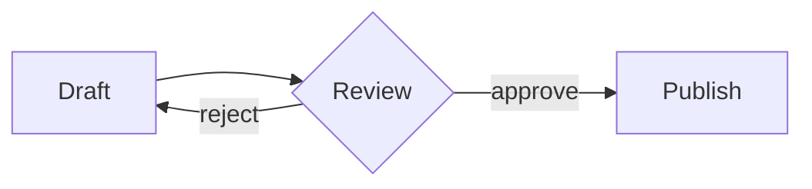

# Diagrams in documents

Documents are plain markdown, but two fenced code block languages get
progressive enhancement in the web app: ` ```mermaid ` and ` ```bpmn `.
Everywhere else — the CLI, the API, exports — they stay ordinary code
blocks, so nothing downstream needs to understand them.

Rendering happens client-side and lazily: the diagram libraries only
load on pages that actually contain a matching block. Each rendered
figure has a copy button (copies the source) and an expand button
(fullscreen pan/zoom). If a block fails to parse, an inline error is
shown and the original code block is left in place.

## Mermaid

Any [Mermaid](https://mermaid.js.org) diagram type works:


```mermaid
flowchart LR
  A[Draft] --> B{Review}
  B -->|approve| C[Publish]
  B -->|reject| A
```

## BPMN 2.0

A ` ```bpmn ` block must contain a complete BPMN 2.0 XML document,
rendered with [bpmn-js](https://bpmn.io). Two rules matter:

1. **The DI section is required.** bpmn-js does no auto-layout. Every
   element needs a `BPMNShape` (with `dc:Bounds`) and every sequence
   flow a `BPMNEdge` (with `di:waypoint`s) inside the
   `bpmndi:BPMNDiagram` section, or the import fails with an inline
   error. Files exported from any BPMN modeler include this already;
   hand-written XML must too.
2. **Only bpmn fences render.** A plain ` ```xml ` block is left
   alone, so XML snippets in ordinary notes are never hijacked.

Minimal working skeleton to copy:

```bpmn
<?xml version="1.0" encoding="UTF-8"?>
<bpmn:definitions xmlns:bpmn="http://www.omg.org/spec/BPMN/20100524/MODEL"
                  xmlns:bpmndi="http://www.omg.org/spec/BPMN/20100524/DI"
                  xmlns:dc="http://www.omg.org/spec/DD/20100524/DC"
                  xmlns:di="http://www.omg.org/spec/DD/20100524/DI"
                  id="Definitions_1"
                  targetNamespace="http://bpmn.io/schema/bpmn">
  <bpmn:process id="Process_1" isExecutable="false">
    <bpmn:startEvent id="Start_1" name="Request received">
      <bpmn:outgoing>Flow_1</bpmn:outgoing>
    </bpmn:startEvent>
    <bpmn:task id="Task_1" name="Handle request">
      <bpmn:incoming>Flow_1</bpmn:incoming>
      <bpmn:outgoing>Flow_2</bpmn:outgoing>
    </bpmn:task>
    <bpmn:endEvent id="End_1" name="Done">
      <bpmn:incoming>Flow_2</bpmn:incoming>
    </bpmn:endEvent>
    <bpmn:sequenceFlow id="Flow_1" sourceRef="Start_1" targetRef="Task_1" />
    <bpmn:sequenceFlow id="Flow_2" sourceRef="Task_1" targetRef="End_1" />
  </bpmn:process>
  <bpmndi:BPMNDiagram id="BPMNDiagram_1">
    <bpmndi:BPMNPlane id="BPMNPlane_1" bpmnElement="Process_1">
      <bpmndi:BPMNShape id="Start_1_di" bpmnElement="Start_1">
        <dc:Bounds x="152" y="102" width="36" height="36" />
      </bpmndi:BPMNShape>
      <bpmndi:BPMNShape id="Task_1_di" bpmnElement="Task_1">
        <dc:Bounds x="240" y="80" width="100" height="80" />
      </bpmndi:BPMNShape>
      <bpmndi:BPMNShape id="End_1_di" bpmnElement="End_1">
        <dc:Bounds x="392" y="102" width="36" height="36" />
      </bpmndi:BPMNShape>
      <bpmndi:BPMNEdge id="Flow_1_di" bpmnElement="Flow_1">
        <di:waypoint x="188" y="120" />
        <di:waypoint x="240" y="120" />
      </bpmndi:BPMNEdge>
      <bpmndi:BPMNEdge id="Flow_2_di" bpmnElement="Flow_2">
        <di:waypoint x="340" y="120" />
        <di:waypoint x="392" y="120" />
      </bpmndi:BPMNEdge>
    </bpmndi:BPMNPlane>
  </bpmndi:BPMNDiagram>
</bpmn:definitions>
```

## Comparing two versions of a diagram

A ` ```bpmn ` fence lives inside an ordinary document, so the document's
version chain is also the diagram's version history. The web app uses
that to render a visual diff: open a document, click **history**, select
a version, and the **diff** tab appears whenever both sides carry a
diagram.

Nothing about the diff is stored. Both sides are whole, valid BPMN
documents, and [bpmn-js-differ](https://github.com/bpmn-io/bpmn-js-differ)
computes the difference at read time. A derived diff cannot drift from
the versions it describes, and any two versions can be compared, not only
adjacent ones. **Do not invent a diff encoding inside the XML** — write
the next whole version instead.

Selecting a past version compares it against the current head ("what has
changed since"); selecting the head compares it against its predecessor
("what this commit changed"). The older version renders on the left and
the newer on the right, because removed elements exist only in the old
document and added ones only in the new. Added is green, removed red,
changed amber, and moved blue and collapsed by default.

Two authoring rules keep a diff readable:

1. **Element ids are immutable.** The diff is keyed on `id`. Renaming a
   task means changing its `name` and keeping its id; changing the id
   turns one rename into a delete plus an add. New elements get new,
   previously unused ids.
2. **Preserve DI verbatim.** Copy every untouched `dc:Bounds` and
   `di:waypoint` exactly. Compute coordinates only for what you actually
   touched. A wholesale re-layout marks every element as moved and buries
   the real change.

Pair each revision with `--message` on the write. The diff shows what
changed; the version message is the only place why it changed survives.

Elements missing DI parse but never draw, so the diff view lists them
explicitly rather than showing a diagram with invisible parts.

A related trap, since it registers as a layout change rather than an
error: an edge's final waypoint must sit on the border it approaches
from. For a target at `y` with height `h`, a leg coming up from below
ends at `y + h`, not at `y`. Ending an upward leg at `y` parses fine and
then draws the line straight through the shape with the arrowhead
floating above it.

Layout conventions that read well: events are 36×36, gateways 50×50;
flow left-to-right on a shared horizontal centerline; leave ~50px gaps
between shapes. **Size each task to its name**: keep the label to two
lines, and make the box wide enough that each line fits — roughly 6px
per character plus 20px padding (e.g. a 28-character line needs a
~190px-wide box). Long names in a default 100×80 box wrap into the
task's top-left type icon and look broken. For processes beyond ~20
elements, model in a dedicated BPMN tool and paste the exported XML
into the fence.

BPMN figures carry a "powered by bpmn.io" attribution link — a
requirement of the bpmn-js license.
